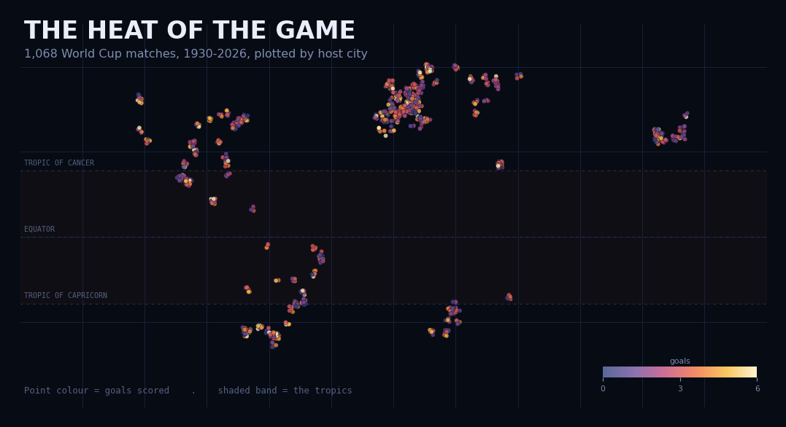

# The Heat of the Game

**Does weather change a World Cup match?** An end-to-end data study over every
World Cup match from 1930 to 2026, built to be honest about what the data can
and cannot prove.

[**> Live interactive atlas**](https://abdulsamadsanni.github.io/wc-weather/) - 1,068 matches plotted by host
city across a century, scrubbable tournament by tournament, with three
documented extreme-heat matches verified against contemporary reporting.



## The question, and the honest answer

**See [FINDINGS.md](FINDINGS.md) for the full written results.** In short:

The naive version of this project would correlate goals against temperature and
declare that heat slows the game. That number is not trustworthy, because the
single largest pattern in World Cup scoring has nothing to do with weather:

| Tournament | Goals / match |
|---|---|
| 1954 (Switzerland) | 5.38 |
| 1990 (Italy) | 2.21 |
| 2026 (in progress) | 2.96 |

Scoring more than halved between 1954 and 1990 as tactics tightened, a swing far
larger than any plausible weather effect. Host selection bundles climate with
playing style, and altitude and kickoff time pull in their own directions. So
the analysis here does not stop at a correlation. It measures the raw
temperature effect, then holds era, host, latitude and humidity constant and
reports how far the effect moves. That movement is the result, not the headline
number.

## Pipeline

```
loader.py        pull + filter World Cup matches      (martj42/international_results)
geocode.py       attach lat/lon, fully offline        (geonamescache + alias table)
weather.py       join real per-match conditions       (Open-Meteo archive, free, no key)
analyze.py       naive vs controlled temperature effect (statsmodels OLS)
build_viz_data.py regenerate the embedded atlas
```

## Run it

**Just want to see the result?** Open `viz/index.html` in any browser. No Python, no setup.

**To populate real weather and run the analysis:**

```bash
git clone https://github.com/abdulsamadsanni/wc-weather.git
cd wc-weather
pip install -r requirements.txt
python src/loader.py          # -> data/wc_matches_raw.csv
python src/geocode.py         # -> data/wc_matches.csv      (100% of cities)
python src/weather.py         # -> data/wc_matches_weather.csv  (~15 min, cached, needs internet)
python src/analyze.py         # prints naive vs controlled temperature effect
python src/build_viz_data.py  # refreshes viz/index.html with real temperatures
```

Paths are anchored to the project folder, so the order is all that matters - not
which directory you launch from. In VS Code you can also just press the Run
button on each file in the sequence above.

`weather.py` caches every API response, so re-runs are instant and you never hit
Open-Meteo for the same match twice. The 1930-1938 tournaments predate the
weather archive and are excluded from the weather model rather than guessed.

## Data and methods

- **Matches**: martj42/international_results (CC0), filtered to FIFA World Cup.
- **Geocoding**: offline, no external service, 100% coverage of 179 host cities.
- **Weather**: Open-Meteo historical archive, hourly temperature, humidity and
  apparent temperature averaged over the afternoon-evening kickoff window.
- **Leakage and confounding**: every weather value is the condition at the match
  itself, joined after the fact, so there is no future information in any
  feature. The controlled model uses decade and host fixed effects to separate
  climate from era and league style.
- **Verified conditions** shown in the atlas are cross-checked against ESPN,
  FIFA and contemporary reporting (2014 Manaus cooling break, 2014 Fortaleza
  knockout cooling break, 2022 Qatar climate-controlled stadiums).

## Why it is built this way

The interesting engineering is not the model, it is the discipline around it:
refusing to fabricate weather for pre-1940 matches, separating a real climate
signal from the era trend that would otherwise masquerade as one, and shipping a
visualization that states its own limits instead of overselling a finding.

## Skills demonstrated

- **Data engineering**: a reproducible pipeline from a raw public dataset to an
  analysis-ready table, including offline geocoding to 100% coverage of host cities.
- **API integration**: one weather source consumed two ways, a cached batch
  pipeline in Python and a live in-browser join in JavaScript.
- **Statistics**: fixed-effects regression to isolate a candidate effect from era
  and host confounders, and reporting a null result honestly when one appears.
- **Data visualization**: a hand-built interactive SVG atlas with no charting
  library, performing on-hover live data retrieval.
- **Methodology**: leakage-aware joins, explicit handling of missing pre-1940
  data, and stated limitations.

## Acknowledgements and licensing

- Match data: [martj42/international_results](https://github.com/martj42/international_results), public domain (CC0).
- Weather: [Open-Meteo](https://open-meteo.com/) historical archive, licensed CC BY 4.0.
- Geocoding: [geonamescache](https://github.com/yaph/geonamescache), built on GeoNames data (CC BY 4.0).

This project's own code is released under the MIT License (see `LICENSE`).
